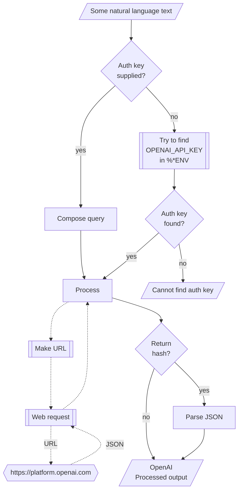

# ML::FindTextualAnswer Raku package

## In brief


-----

## Installation

Package installations from both sources use [zef installer](https://github.com/ugexe/zef)
(which should be bundled with the "standard" Rakudo installation file.)

To install the package from [Zef ecosystem](https://raku.land/) use the shell command:

```
zef install ML::FindTextualAnswer
```

To install the package from the GitHub repository use the shell command:

```
zef install https://github.com/antononcube/Raku-ML-FindTextualAnswer.git
```

----

## Usage examples

Here is an example of finding textual answers:

```perl6
use ML::FindTextualAnswer;
my $text = "Lake Titicaca is a large, deep lake in the Andes 
on the border of Bolivia and Peru. By volume of water and by surface 
area, it is the largest lake in South America";

find-textual-answer($text, "Where is Titicaca?")
```

By default `find-textual-answer` tries to give short answers.
If the option "request" is `Whatever` then depending on the number of questions 
the request is one those phrases:
- "give the shortest answer of the question:"
- "list the shortest answers of the questions:"

In the example above the full query given to OpenAI's models is

> Given the text "Lake Titicaca is a large, deep lake in the Andes
on the border of Bolivia and Peru. By volume of water and by surface
area, it is the largest lake in South America" 
> give the shortest answer of the question:   
> Where is Titicaca?

Here we get a longer answer by changing the value of "request":

```perl6
find-textual-answer($text, "Where is Titicaca?", request => "answer the question:")
```

**Remark:** The function `find-textual-answer` is inspired by the Mathematica function
[`FindTextualAnswer`](https://reference.wolfram.com/language/ref/FindTextualAnswer.html); 
see [JL1]. Unfortunately, at this time implementing the full signature of `FindTextualAnswer`
with OpenAI's API is not easy. (Or cheap to execute.)

#### Multiple questions

If several questions are given to the function `openai-find-textual-answer`
then all questions are spliced with the given text into one query (that is sent to OpenAI.)

For example, consider the following text and questions:

```perl6
my $query = 'Make a classifier with the method RandomForest over the data dfTitanic; show precision and accuracy.';

my @questions =
        ['What is the dataset?',
         'What is the method?',
         'Which metrics to show?'
        ];
```

Then the query send to OpenAI is:

> Given the text: "Make a classifier with the method RandomForest over the data dfTitanic; show precision and accuracy."
> list the shortest answers of the questions:   
> 1) What is the dataset?   
> 2) What is the method?    
> 3) Which metrics to show?   


The answers are assumed to be given in the same order as the questions, each answer in a separated line.
Hence, by splitting the OpenAI result into lines we get the answers corresponding to the questions.  

If the questions are missing question marks, it is likely that the result may have a completion as 
a first line followed by the answers. In that situation the answers are not parsed and a warning message is given.

-------

## Command Line Interface

The package provides a CLI script for finding textual answers:

```shell
find-textual-answer --help
```

--------

## Mermaid diagram

The following flowchart corresponds to the steps in the package function `openai-playground`:



--------

## References

### Articles

[AA1] Anton Antonov,
["Connecting Mathematica and Raku"](https://rakuforprediction.wordpress.com/2021/12/30/connecting-mathematica-and-raku/),
(2021),
[RakuForPrediction at WordPress](https://rakuforprediction.wordpress.com).

[JL1] Jérôme Louradour,
["New in the Wolfram Language: FindTextualAnswer"](https://blog.wolfram.com/2018/02/15/new-in-the-wolfram-language-findtextualanswer),
(2018),
[blog.wolfram.com](https://blog.wolfram.com/).

### Packages

[AAp1] Anton Antonov,
[WWW::OpenAI Raku package](https://github.com/antononcube/Raku-WWW-OpenAI),
(2023),
[GitHub/antononcube](https://github.com/antononcube).

[AAp2] Anton Antonov,
[WWW::PaLM Raku package](https://github.com/antononcube/Raku-WWW-PaLM),
(2023),
[GitHub/antononcube](https://github.com/antononcube).
