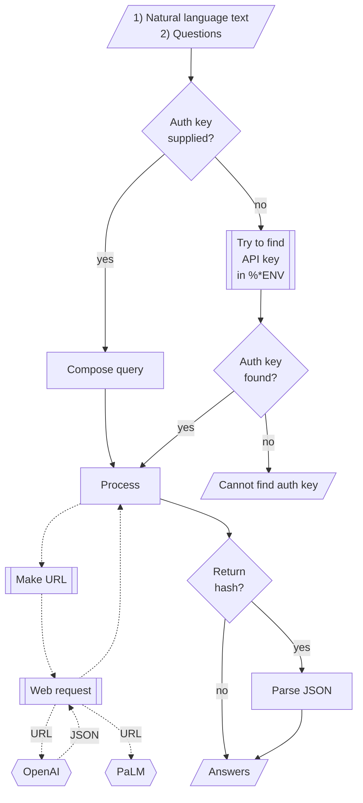

# ML::FindTextualAnswer Raku package

## In brief

This package provides function(s) for finding sub-strings in texts that appear to be answers
to given questions according to certain Machine Learning (ML) algorithms or
Large Language Models (LLMs).

**Remark:** Currently only LLMs are used via the packages "WWW::OpenAI", [AAp1], and "WWW::PaLM", [AAp2],

**Remark:** The LLMs are utilized via the packages "LLM::Functions", [AAp3], and "Text::SubParsers", [AAp4].

**Remark:** One of the primary motivations for implementing this package is to provide
the fundamental functionality of extracting parameter values from (domain specific) texts 
needed for the implementation of "ML::NLPTemplateEngine", [AAp5].

-----

## Installation

Package installations from both sources use [zef installer](https://github.com/ugexe/zef)
(which should be bundled with the "standard" Rakudo installation file.)

To install the package from [Zef ecosystem](https://raku.land/) use the shell command:

```
zef install ML::FindTextualAnswer
```

To install the package from the GitHub repository use the shell command:

```
zef install https://github.com/antononcube/Raku-ML-FindTextualAnswer.git
```

----

## Usage examples

Here is an example of finding textual answers:

```perl6
use ML::FindTextualAnswer;

my $text = "Lake Titicaca is a large, deep lake in the Andes 
on the border of Bolivia and Peru. By volume of water and by surface 
area, it is the largest lake in South America";

find-textual-answer($text, "Where is Titicaca?")
```

By default `find-textual-answer` tries to give short answers.
If the option "request" is `Whatever` then depending on the number of questions 
the request is one those phrases:
- "give the shortest answer of the question:"
- "list the shortest answers of the questions:"

In the example above the full query given to LLM is

> Given the text "Lake Titicaca is a large, deep lake in the Andes
on the border of Bolivia and Peru. By volume of water and by surface
area, it is the largest lake in South America" 
> give the shortest answer of the question:   
> Where is Titicaca?

Here we get a longer answer by changing the value of "request":

```perl6
find-textual-answer($text, "Where is Titicaca?", request => "answer the question:")
```

**Remark:** The function `find-textual-answer` is inspired by the Mathematica function
[`FindTextualAnswer`](https://reference.wolfram.com/language/ref/FindTextualAnswer.html), [WRI1]; 
see [JL1] for details. Unfortunately, at this time implementing the full signature of `FindTextualAnswer`
with APIs of OpenAI and PaLM is not easy.

### Multiple answers

Consider the text: 

```perl6
my $textCap = q:to/END/;
Born and raised in the Austrian Empire, Tesla studied engineering and physics in the 1870s without receiving a degree,
gaining practical experience in the early 1880s working in telephony and at Continental Edison in the new electric power industry.

In 1884 he emigrated to the United States, where he became a naturalized citizen.
He worked for a short time at the Edison Machine Works in New York City before he struck out on his own.
With the help of partners to finance and market his ideas,
Tesla set up laboratories and companies in New York to develop a range of electrical and mechanical devices.
His alternating current (AC) induction motor and related polyphase AC patents, licensed by Westinghouse Electric in 1888,
earned him a considerable amount of money and became the cornerstone of the polyphase system which that company eventually marketed.
END

$textCap.chars
```

Here we ask a single question and request 3 answers:

```perl6
find-textual-answer($textCap, 'Where lived?', 3, finder => 'PaLM')
```

Here is a rerun without number of answers argument:

```perl6
find-textual-answer($textCap, 'Where lived?', finder => 'PaLM')
```

### Multiple questions

If several questions are given to the function `find-textual-answer`
then all questions are spliced with the given text into one query (that is sent to LLM.)

For example, consider the following text and questions:

```perl6
my $query = 'Make a classifier with the method RandomForest over the data dfTitanic; show precision and accuracy.';

my @questions =
        ['What is the dataset?',
         'What is the method?',
         'Which metrics to show?'
        ];
```

Then the query send to the LLM (ChatGPT/PaLM/YandexGPT) is:

> Given the text: "Make a classifier with the method RandomForest over the data dfTitanic; show precision and accuracy."
> list the shortest answers of the questions:   
> 1) What is the dataset?   
> 2) What is the method?    
> 3) Which metrics to show?   


The answers are assumed to be given in the same order as the questions, each answer in a separated line.
Hence, by splitting the LLM result into lines we get the answers corresponding to the questions.  

If the questions are missing question marks, it is likely that the result may have a completion as 
a first line followed by the answers. In that situation the answers are not parsed and a warning message is given.

Here is example of requesting answers to multiple questions and specifying that result should be a list of pairs: 

```perl6
my %res = find-textual-answer($query, @questions, finder => 'PaLM', :pairs);

.say for %res;
````

-------

## LLM functions

This package, "ML::FindTextualAnswer", uses LLMs via the package "LLM::Functions".

Upon installation the package "LLM::Functions" knows how to access the LLMs ChatGPT and PaLM.
(I.e. "LLM::Functions" dependents on "WWW::OpenAI" and "WWW:PaLM".)

In some situations it would be preferable to have a pre-configured LLM function for finding 
the textual answers. Such functions can be obtained with `llm-textual-answer-function`. 
Here is an example:

```perl6
my &fta = llm-textual-answer-function(llm-evaluator => 'PaLM'):pairs;

&fta($query, @questions)
```

That is roughly equivalent to making of the LLM function:

```perl6
use LLM::Functions;
use Text::SubParsers;
use ML::FindTextualAnswer::LLM::TextualAnswer;

my &fta2 =
        llm-function(
        { "Given the text: $^a \nAnswer the following questions:\n$^b." },
                llm-evaluator => llm-configuration('PaLM', prompts => default-prompt),
                form => sub-parser('JSON'));
```


-------

## Command Line Interface

The package provides a CLI script for finding textual answers:

```shell
find-textual-answer --help
```

Here is an example invocation:

```shell
find-textual-answer 'Colors in preference order: blue, red, green, white, pink, cherry, light brown.' -q='What is the favorite color?'
```

--------

## Mermaid diagram

The following flowchart corresponds to the ***conceptual*** steps in the package function
`find-textual-answer` with a finder spec that is an `LLM::Functions::Evaluator` object 
("LLM" stands for "Large Language Models"):



At this point for "LLM finders" the functions `find-textual-answer` uses the function
`ML::FindTextualAnswer::LLM::TextualAnswer::Fetch`, which, in turn, is based on the 
the packages "LLM::Functions" and "Text::SubParsers". 

--------

## TODO

### TODO LLM implementation

- [X] DONE Heuristic for splitting and assigning multiple answers   
- [X] DONE Separate functions:
  - [X] DONE `llm-find-textual-answer` 
  - [X] DONE `llm-find-textual-answer-function` 
  - [X] DONE `llm-classify` 
- [X] DONE Refactor using ["LLM::Functions"](https://github.com/antononcube/Raku-LLM-Functions)
  - [X] DONE `Fetch`
  - [X] DONE `llm-textual-answer`
  - [X] DONE `llm-classify`
- [ ] TODO Post-processing
  - [X] DONE Implement post-processing of `sub-parser('JSON')` LLM function calls.
  - [ ] TODO Implement grammar-based post processing
    - This requires investigating a fair amount of cases.
- [ ] TODO CLI
  - [X] DONE `find-textual-answer`
  - [ ] TODO `llm-classify` 
- [ ] TODO Documentation
  - [ ] TODO Document of all parameters
    - [ ] TODO number of answers per question
    - [ ] TODO pairs 
    - [ ] TODO prelude
    - [ ] TODO request
    - [ ] TODO strip-with
  - [ ] TODO More detailed primary use cases
  - [ ] TODO Classification over a large set of DSL commands
    - [ ] TODO DSL commands from previous work 
    - [ ] TODO Precision and recall `llm-classify`

### TODO Patterns (non-LLM) implementation

- [ ] TODO Come up with (semi-)automatic patterns discovery strategy     
- [ ] TODO Derive / obtain patterns
- [ ] TODO Program the pattern-based answers extraction
    
--------

## References

### Articles

[AA1] Anton Antonov,
["Connecting Mathematica and Raku"](https://rakuforprediction.wordpress.com/2021/12/30/connecting-mathematica-and-raku/),
(2021),
[RakuForPrediction at WordPress](https://rakuforprediction.wordpress.com).

[JL1] Jérôme Louradour,
["New in the Wolfram Language: FindTextualAnswer"](https://blog.wolfram.com/2018/02/15/new-in-the-wolfram-language-findtextualanswer),
(2018),
[blog.wolfram.com](https://blog.wolfram.com/).

### Functions

[WRI1] Wolfram Research (2018), 
FindTextualAnswer, 
Wolfram Language function, https://reference.wolfram.com/language/ref/FindTextualAnswer.html (updated 2020).

### Packages

[AAp1] Anton Antonov,
[WWW::OpenAI Raku package](https://github.com/antononcube/Raku-WWW-OpenAI),
(2023),
[GitHub/antononcube](https://github.com/antononcube).

[AAp2] Anton Antonov,
[WWW::PaLM Raku package](https://github.com/antononcube/Raku-WWW-PaLM),
(2023),
[GitHub/antononcube](https://github.com/antononcube).

[AAp3] Anton Antonov,
[LLM::Functions Raku package](https://github.com/antononcube/Raku-LLM-Functions),
(2023),
[GitHub/antononcube](https://github.com/antononcube).

[AAp4] Anton Antonov,
[Text::SubParsers Raku package](https://github.com/antononcube/Raku-Text-SubParsers),
(2023),
[GitHub/antononcube](https://github.com/antononcube).

[AAp5] Anton Antonov,
[ML::NLPTemplateEngine Raku package](https://github.com/antononcube/Raku-ML-NLPTemplateEngines),
(2023),
[GitHub/antononcube](https://github.com/antononcube).
