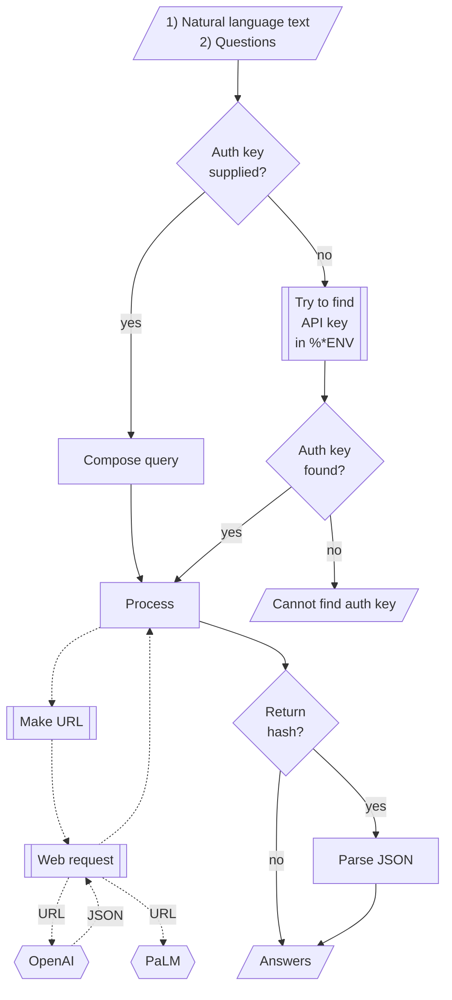

# ML::FindTextualAnswer Raku package

## In brief

This package provides function(s) for finding sub-strings in texts that appear to be answers
to given questions according to certain Machine Learning (ML) algorithms or
Large Language Models (LLMs).

**Remark:** Currently only LLMs are used via the packages "WWW::OpenAI", [AAp1], and "WWW::PaLM", [AAp2].

-----

## Installation

Package installations from both sources use [zef installer](https://github.com/ugexe/zef)
(which should be bundled with the "standard" Rakudo installation file.)

To install the package from [Zef ecosystem](https://raku.land/) use the shell command:

```
zef install ML::FindTextualAnswer
```

To install the package from the GitHub repository use the shell command:

```
zef install https://github.com/antononcube/Raku-ML-FindTextualAnswer.git
```

----

## Usage examples

Here is an example of finding textual answers:

```perl6
use ML::FindTextualAnswer;
my $text = "Lake Titicaca is a large, deep lake in the Andes 
on the border of Bolivia and Peru. By volume of water and by surface 
area, it is the largest lake in South America";

find-textual-answer($text, "Where is Titicaca?")
```
```
# Titicaca is located in Bolivia.
```

By default `find-textual-answer` tries to give short answers.
If the option "request" is `Whatever` then depending on the number of questions 
the request is one those phrases:
- "give the shortest answer of the question:"
- "list the shortest answers of the questions:"

In the example above the full query given to LLM is

> Given the text "Lake Titicaca is a large, deep lake in the Andes
on the border of Bolivia and Peru. By volume of water and by surface
area, it is the largest lake in South America" 
> give the shortest answer of the question:   
> Where is Titicaca?

Here we get a longer answer by changing the value of "request":

```perl6
find-textual-answer($text, "Where is Titicaca?", request => "answer the question:")
```
```
# Lake Titicaca is in Peru.
```

**Remark:** The function `find-textual-answer` is inspired by the Mathematica function
[`FindTextualAnswer`](https://reference.wolfram.com/language/ref/FindTextualAnswer.html), [WRI1]; 
see [JL1] for details. Unfortunately, at this time implementing the full signature of `FindTextualAnswer`
with APIs of OpenAI and PaLM is not easy.

#### Multiple questions

If several questions are given to the function `find-textual-answer`
then all questions are spliced with the given text into one query (that is sent to LLM.)

For example, consider the following text and questions:

```perl6
my $query = 'Make a classifier with the method RandomForest over the data dfTitanic; show precision and accuracy.';

my @questions =
        ['What is the dataset?',
         'What is the method?',
         'Which metrics to show?'
        ];
```
```
# [What is the dataset? What is the method? Which metrics to show?]
```

Then the query send to the LLM (ChatGPT/PaLM/YandexGPT) is:

> Given the text: "Make a classifier with the method RandomForest over the data dfTitanic; show precision and accuracy."
> list the shortest answers of the questions:   
> 1) What is the dataset?   
> 2) What is the method?    
> 3) Which metrics to show?   


The answers are assumed to be given in the same order as the questions, each answer in a separated line.
Hence, by splitting the LLM result into lines we get the answers corresponding to the questions.  

If the questions are missing question marks, it is likely that the result may have a completion as 
a first line followed by the answers. In that situation the answers are not parsed and a warning message is given.

-------

## Command Line Interface

The package provides a CLI script for finding textual answers:

```shell
find-textual-answer --help
```
```
# Usage:
#   find-textual-answer [<words> ...] [-q|--questions=<Str>] [--llm=<Str>] [--mt|--max-tokens[=UInt]] [-m|--llm-model=<Str>] [-t|--temperature[=Real]] [-r|--request=<Str>] [-p|--pairs] [-a|--auth-key=<Str>] [--timeout[=UInt]] [--echo] [-f|--format=<Str>] [--method=<Str>] -- Command given as a sequence of words.
#   
#     -q|--questions=<Str>        Questions separated with '?' or ';'.
#     --llm=<Str>                 Large Language Model, one of 'openai', 'palm', or 'Whatever'. [default: 'Whatever']
#     --mt|--max-tokens[=UInt]    The maximum number of tokens to generate in the completion. [default: 300]
#     -m|--llm-model=<Str>        Model. [default: 'Whatever']
#     -t|--temperature[=Real]     Temperature. [default: 0.7]
#     -r|--request=<Str>          Request. [default: 'Whatever']
#     -p|--pairs                  Should question-answer pairs be returned or not? [default: False]
#     -a|--auth-key=<Str>         Authorization key (to use OpenAI API.) [default: 'Whatever']
#     --timeout[=UInt]            Timeout. [default: 10]
#     --echo                      Should the query, result, answer be echoed or not? [default: False]
#     -f|--format=<Str>           Format of the result; one of "json", "hash", "values", or "Whatever". [default: 'values']
#     --method=<Str>              Method for the HTTP POST query; one of "tiny" or "curl". [default: 'tiny']
```

--------

## Mermaid diagram

The following flowchart corresponds to the steps in the package function `find-textual-answer` 
with method "LLM" (which stands for "Large Language Models"):



--------

## References

### Articles

[AA1] Anton Antonov,
["Connecting Mathematica and Raku"](https://rakuforprediction.wordpress.com/2021/12/30/connecting-mathematica-and-raku/),
(2021),
[RakuForPrediction at WordPress](https://rakuforprediction.wordpress.com).

[JL1] Jérôme Louradour,
["New in the Wolfram Language: FindTextualAnswer"](https://blog.wolfram.com/2018/02/15/new-in-the-wolfram-language-findtextualanswer),
(2018),
[blog.wolfram.com](https://blog.wolfram.com/).

### Functions

[WRI1] Wolfram Research (2018), 
FindTextualAnswer, 
Wolfram Language function, https://reference.wolfram.com/language/ref/FindTextualAnswer.html (updated 2020).

### Packages

[AAp1] Anton Antonov,
[WWW::OpenAI Raku package](https://github.com/antononcube/Raku-WWW-OpenAI),
(2023),
[GitHub/antononcube](https://github.com/antononcube).

[AAp2] Anton Antonov,
[WWW::PaLM Raku package](https://github.com/antononcube/Raku-WWW-PaLM),
(2023),
[GitHub/antononcube](https://github.com/antononcube).
